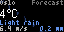
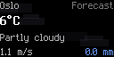

# YR Weather

Animated weather display from the [Norwegian Meteorological Institute](https://api.met.no/) (YR/MET.no). Weather-specific particle animations reflect current conditions in real time.

 

## Features

- **Locationforecast** - weather for any location on earth
- **Nowcast** - precise short-term forecasts for the Nordic area (radar-based)
- **Animated weather backgrounds** matching current conditions:
  - Rain: multi-layered falling streaks with splash effects
  - Snow: drifting flakes at varying sizes/speeds with ground buildup
  - Thunder: heavy rain with zigzag lightning bolts and sky flashes
  - Sleet: mixed rain and snow particles
  - Fog: pulsing horizontal bands drifting in opposite directions
  - Clouds: multi-depth cloud shapes with top bumps drifting across
  - Clear: pulsing sun glow with radiating rays and warm horizon
- Displays temperature, condition, wind speed, and precipitation
- Celsius / Fahrenheit toggle
- No API key required (free MET.no API)
- 2x display support

## Configuration

| Field | Description |
|---|---|
| **Location** | Location picker (defaults to Oslo, Norway) |
| **Data Source** | Locationforecast (global) or Nowcast (Nordic only) |
| **Temperature** | Celsius or Fahrenheit |

## Usage

```sh
# Render (defaults to Oslo)
pixlet render apps/yrweather/yr_weather.star

# 2x resolution
pixlet render apps/yrweather/yr_weather.star -2

# Nowcast mode
pixlet render apps/yrweather/yr_weather.star source=nowcast

# Custom location (JSON)
pixlet render apps/yrweather/yr_weather.star location='{"lat":"51.5074","lng":"-0.1278","locality":"London"}'

# Live preview
pixlet serve apps/yrweather/yr_weather.star
```

## Data Sources

| Source | Coverage | Update Frequency | Cache TTL |
|---|---|---|---|
| [Locationforecast 2.0](https://api.met.no/weatherapi/locationforecast/2.0) | Global | ~every 6 hours | 30 min |
| [Nowcast 2.0](https://api.met.no/weatherapi/nowcast/2.0) | Nordic area | ~every 5 min | 5 min |

Data provided by the Norwegian Meteorological Institute under [CC BY 4.0](https://creativecommons.org/licenses/by/4.0/).
